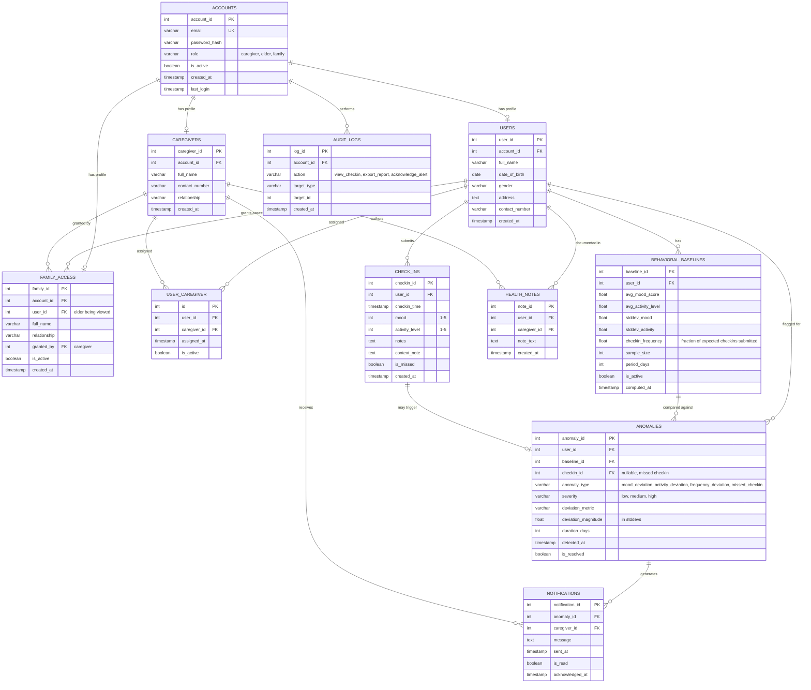

# Baselium+

A behavioral monitoring system for the elderly that builds a **per-elder statistical baseline** from daily self-reported check-ins, and alerts caregivers in real time when behavior deviates from that baseline — with an explainable reason attached, not just a generic notification.

## What it does
- Elders check in daily via a mobile app (mood, activity, optional note).
- The system learns a rolling 7-day statistical baseline per elder.
- Deviations from that baseline are detected, classified by severity, and pushed to caregivers as in-app alerts.
- Caregivers get a dashboard with trends, alert history, downloadable reports, and (if managing multiple elders) a severity-sorted triage view.
- Family members can be granted read-only access, and are notified only on high-severity anomalies.

## Who it's for
| Role | Access |
|---|---|
| **Elder** | Submits daily check-ins, receives reminders |
| **Caregiver** | Full dashboard, alerts, reports, manages elder/family access |
| **Family Viewer** | Read-only status view, high-severity alerts only |

## Tech stack
- **Elder client (current):** responsive React web check-in screen (React Native deferred)
- **Web:** React
- **Backend:** Go (Gin/Echo) + sqlc
- **Database:** PostgreSQL
- **Notifications:** WebSockets for active dashboards (FCM deferred; see D13)
- **Auth:** JWT, role-based

## Repo layout (backend)
```
internal/
├── auth/          # JWT, role middleware
├── checkin/       # daily check-in capture
├── baseline/      # rolling mean/stddev/frequency computation
├── anomaly/       # deviation detection + severity classification
├── notification/  # FCM, WebSocket, retry logic
├── dashboard/     # trends, triage view, reports
├── family/        # read-only access grant/revoke
└── audit/         # audit_logs (Data Privacy Act compliance)
```

## Entity-Relationship Diagram

> Editable Mermaid ERD — matches the DBML schema this project is built from. Edit this block directly (add/remove fields or tables) and it re-renders anywhere Mermaid is supported (GitHub, most Markdown editors, VS Code with a Mermaid extension).



The raw source of truth for this schema (DBML format, used to generate the actual Postgres migrations) lives in `schema.dbml` — edit that file if you're going to run migrations, and update this Mermaid block to match so the docs don't drift.

## Docs
- [`PROJECT_CONTEXT.md`](./PROJECT_CONTEXT.md) — goals, architecture, coding rules, constraints, implementation status
- [`TODO.md`](./TODO.md) — current tasks by phase
- [`DECISIONS.md`](./DECISIONS.md) — why key architectural decisions were made
